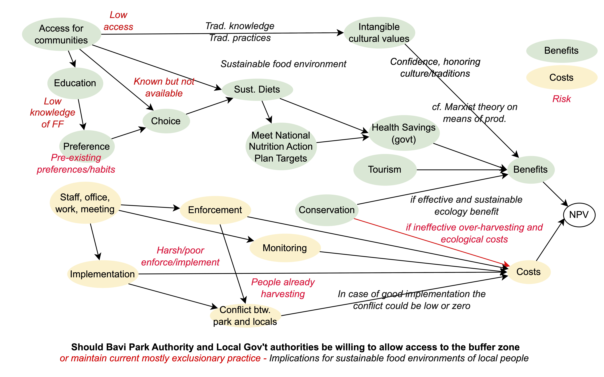

```{r setup, include=FALSE}
knitr::opts_chunk$set(echo = TRUE, message=FALSE)
library(ggplot2)
library(reshape2)
library(tidyverse)
```

This project is concerned with the interrelated issues of conservation and nutrition. Specifically we are applying Monte Carlo simulations based on expert knowledge to assess the dietary and conservation implications of allowing forest access to communities around a conservation area in Vietnam.

We use well-established and flexible method for decision modeling with expert-derived probabilities and variances to estimate outcomes. With this method we can capture the variability and uncertainty in model inputs. We can apply this to guide decision-making by identifying likely outcomes and their variability.

We go through several iterative processes to simulate the effects of different park management strategies (e.g., restricting access, providing seedlings) on species conservation, dietary diversity, financial cost to the park service and cultural heritage, i.e. retaining or losing traditional knowledge.



# Generalized Function 

```{r child="A_Generalized_function.Rmd"}
```

# Estimates 

```{r child = "B_Estimates.Rmd"}
```

# Update based on field observations {#update_model}

```{r child = "C_Update.Rmd"}
```

# Generalize the update to all species in the collection (from all trips)

```{r child = "D_Update_all_species.Rmd"}
```
